# Kedro Migration Agent

A comprehensive AI-powered tool that migrates Jupyter notebooks to Kedro framework projects using LangChain and LangGraph ecosystem.

## 🎯 Overview

The Kedro Migration Agent automates the complex process of converting Jupyter notebooks into production-ready Kedro pipelines. It uses advanced LLM analysis to understand notebook intent, extract functions, create proper data catalogs, and scaffold complete Kedro projects.

## 🛠 Tech Stack

### Core Framework
- **LangChain** - LLM orchestration and tool management
- **LangGraph** *(Future)* - Stateful workflow management and human-in-the-loop processes
- **ChatOllama** - Local LLM integration (Llama3)

### Backend
- **FastAPI** - REST API backend
- **Uvicorn** - ASGI server
- **Python 3.12+** - Core runtime

### Frontend
- **Streamlit** - Interactive web interface
- **Pandas** - Data manipulation and display

### Analysis & Processing
- **nbformat** - Jupyter notebook parsing
- **AST** - Python code analysis
- **JSON** - Data serialization
- **Transformers** *(Optional)* - Fallback text analysis

### Data & Storage
- **FAISS** *(Future)* - Vector similarity search
- **Sentence Transformers** *(Future)* - Embeddings generation

## 📁 Project Structure

```
kedro-agents/
├── kedro_migration_agent/
│   ├── app.py                 # Streamlit frontend
│   ├── backend.py             # FastAPI backend
│   ├── agent.py               # Main agent orchestration
│   ├── tools/
│   │   ├── ingest_tool.py     # Notebook loading
│   │   ├── summarize_tool.py  # LLM-based cell analysis
│   │   ├── kedro_map_tool.py  # Kedro structure mapping
│   │   └── embed_tool.py      # Vector embeddings (future)
│   ├── config/
│   │   └── settings.yaml      # Configuration
│   └── requirements.txt       # Dependencies
└── README.md                  # This file
```

## 🏗 Current Architecture (MVP)


## 🚀 Current Features (MVP)

### 1. **Notebook Upload & Processing**
- Supports `.ipynb` file uploads via Streamlit interface
- Parses notebook cells and metadata using `nbformat`
- Extracts code, markdown, and cell structure

### 2. **Intelligent Cell Analysis**
- **LLM-Powered Intent Detection**: Uses Llama3 to analyze each cell's purpose
- **Function Extraction**: AST parsing to identify Python functions
- **Smart Categorization**: Distinguishes data loading, processing, visualization, and ML code

### 3. **Kedro Structure Mapping**
- **Automatic Node Creation**: Converts Python functions to Kedro nodes
- **Dataset Inference**: Maps function parameters to input datasets
- **Pipeline Generation**: Creates logical pipeline structures
- **Dual Analysis**: Rule-based + LLM analysis for comprehensive mapping

### 4. **Interactive Frontend**
- **Cell Analysis Table**: Shows notebook cells with LLM-analyzed intents
- **JSON Viewer**: Displays generated Kedro configuration
- **Progress Tracking**: Real-time feedback during processing
- **Download Support**: Export Kedro configurations

## 🎮 Usage

### Prerequisites
- Python 3.12+
- Ollama installed with Llama3 model
- Required dependencies (see requirements.txt)

### Installation
```bash
git clone https://github.com/ravi-kumar-pilla/kedro-agents.git
cd kedro-agents
pip install -r kedro_migration_agent/requirements.txt
```

### Start the Services

1. **Backend (Terminal 1)**:
```bash
cd kedro_migration_agent
uvicorn backend:app --reload --port 8000
```

2. **Frontend (Terminal 2)**:
```bash
cd kedro_migration_agent  
streamlit run app.py
```

### Upload & Process

1. Navigate to `http://localhost:8501`
2. Upload your `.ipynb` file
3. View cell analysis table
4. Examine generated Kedro JSON structure
5. Download configuration for manual Kedro project setup

## 🗺 LangGraph Roadmap: From MVP to Production

### Phase 1: Stateful Workflow Implementation
```python
# Planned LangGraph Structure
from langgraph.graph import StateGraph
from langgraph.checkpoint.sqlite import SqliteSaver

class MigrationState(TypedDict):
    notebook_path: str
    cells_analysis: List[Dict]
    summary: str
    user_approval: bool
    tests_status: str
    kedro_structure: Dict
    project_path: str
```

### Phase 2: Enhanced Features

#### 🔄 **Multi-Step Workflow (Steps 1-9)**

1. **📁 Multi-Notebook Support**
   ```python
   # Directory processing with parallel execution
   async def process_notebook_directory(directory_path: str):
       notebooks = glob.glob("**/*.ipynb", recursive=True)
       return await asyncio.gather(*[process_single_notebook(nb) for nb in notebooks])
   ```

2. **🧠 Kedro-Trained Agent**
   ```python
   # RAG system with Kedro documentation
   kedro_vectorstore = FAISS.from_documents(
       documents=load_kedro_docs() + parse_kedro_source_code(),
       embedding=OpenAIEmbeddings()
   )
   ```

3. **📋 Comprehensive Intent Analysis**
   ```python
   # Multi-layered analysis with confidence scoring
   class NotebookAnalyzer:
       def analyze_with_docstrings(self, notebook)
       def analyze_without_docstrings(self, notebook)
       def cross_validate_analysis(self, results)
   ```

4. **👥 Human-in-the-Loop Approval**
   ```python
   # LangGraph human approval nodes
   def require_human_approval(state: MigrationState):
       return {"human_approval_required": True, "summary": state["summary"]}
   
   def process_approval_feedback(state: MigrationState):
       if not state["user_approval"]:
           return {"retry_analysis": True, "temperature": state["temperature"] + 0.1}
   ```

5. **🧪 Automated Testing Pipeline**
   ```python
   class TestGenerator:
       def generate_unit_tests(self, functions: List[Function])
       def create_mock_data(self, datasets: Dict)
       def run_pytest_suite(self, test_files: List[str])
       def analyze_test_results(self, results: TestResults)
   ```

6. **🗺 KedroViz Integration**
   ```python
   class KedroVizGenerator:
       def create_pipeline_graph(self, nodes, datasets)
       def generate_viz_metadata(self, kedro_structure)
       def export_kedro_viz_json(self, graph_data)
   ```

7. **🏗 Project Scaffolding**
   ```python
   class KedroScaffolder:
       def create_project_structure(self, project_name)
       def generate_pipeline_files(self, nodes, datasets)
       def setup_configuration_files(self, catalog, parameters)
       def create_requirements_txt(self, dependencies)
   ```

8. **✅ Kedro-Specific Testing**
   ```python
   class KedroTestRunner:
       def adapt_tests_for_kedro(self, original_tests)
       def test_pipeline_execution(self, kedro_project)
       def validate_data_catalog(self, catalog_config)
   ```

## 🔮 Future LangGraph Architecture

```mermaid
graph TB
    A[📁 Upload Notebooks] --> B[🧠 LangGraph StateManager]
    B --> C[🔍 Multi-Agent Analysis]
    C --> D[👥 Human Approval Loop]
    D --> E[🧪 Test Generation & Execution]
    E --> F[🏗 Kedro Structure Creation]
    F --> G[📊 KedroViz Graph Generation]  
    G --> H[👥 Human Approval Loop]
    H --> I[🚀 Project Scaffolding]
    I --> J[✅ Kedro Testing & Validation]
    J --> K[🎯 Deployment Ready Project]
    
    subgraph "🤖 AI Agents"
        C1[📋 Notebook Analyzer Agent]
        C2[🔧 Code Quality Agent] 
        C3[🧪 Test Generation Agent]
        C4[⭐ Kedro Expert Agent]
    end
    
    subgraph "💾 State Management"
        S1[📊 Migration State]
        S2[🔄 Checkpoint Manager]
        S3[📝 Audit Trail]
    end
    
    subgraph "🛠 Enhanced Tools"
        T1[📁 Multi-Notebook Processor]
        T2[🧠 RAG Kedro Knowledge Base]
        T3[🧪 PyTest Generator]
        T4[📊 KedroViz Generator]
        T5[🏗 Project Scaffolder]
    end
    
    C --> C1
    C --> C2
    C --> C3
    C --> C4
    
    B --> S1
    B --> S2
    B --> S3
    
    C1 --> T1
    C2 --> T2
    C3 --> T3
    C4 --> T4
    I --> T5
    
    style A fill:#e3f2fd
    style B fill:#f3e5f5
    style K fill:#e8f5e8
    style C1 fill:#fff3e0
    style C2 fill:#fce4ec
    style C3 fill:#e0f2f1
    style C4 fill:#fff8e1
```



## 🤝 Contributing

1. Fork the repository
2. Create a feature branch (`git checkout -b feature/amazing-feature`)
3. Commit your changes (`git commit -m 'Add amazing feature'`)
4. Push to the branch (`git push origin feature/amazing-feature`)
5. Open a Pull Request

## License

This project is licensed under the the [Apache 2.0](https://github.com/ravi-kumar-pilla/kedro-agents/blob/main/LICENSE) License.

## 🙏 Acknowledgments

- [Kedro](https://kedro.org/) - For the amazing data pipeline framework
- [LangChain](https://langchain.com/) - For LLM orchestration capabilities
- [Streamlit](https://streamlit.io/) - For the intuitive web interface
- [Ollama](https://ollama.com/) - For local LLM deployment

---

This roadmap transforms the current MVP into a comprehensive, production-ready migration system with human oversight, automated testing, and intelligent decision-making at every step.