# Agentic Frameworks for Kedro Integration: A Comprehensive Analysis

A detailed comparison and evaluation of LangGraph, AutoGen, and CrewAI for building intelligent Kedro adoption agents.

## 🎯 Summary

This document analyzes three leading agentic frameworks - **LangGraph**, **AutoGen**, and **CrewAI** - to determine the optimal approach for building AI agents that help users adopt and work with Kedro. We evaluate each framework's architecture, advantages, disadvantages, and potential integration strategies with Kedro.

**Recommendation**: **LangGraph** emerges as the optimal choice for Kedro integration due to its state management capabilities, human-in-the-loop workflows, and alignment with Kedro's pipeline philosophy.

---

## 🏗 Framework Architectures

### 1. LangGraph Architecture

```mermaid
graph TB
    subgraph "🧠 LangGraph Core"
        A[StateGraph] --> B[Nodes]
        B --> C[Edges]
        C --> D[Conditional Routing]
        D --> E[Checkpoints]
        E --> F[Human-in-Loop]
    end
    
    subgraph "🔄 State Management"
        G[Shared State]
        H[State Persistence]
        I[State Validation]
    end
    
    subgraph "🛠 Tools & Actions"
        J[LangChain Tools]
        K[Custom Functions]
        L[External APIs]
    end
    
    A --> G
    B --> J
    B --> K
    B --> L
    
    style A fill:#e3f2fd
    style G fill:#f3e5f5
    style J fill:#e8f5e8
```



**Core Concepts:**
- **StateGraph**: Defines workflow as a directed graph
- **Nodes**: Individual processing steps (agents/tools)
- **Edges**: Define flow between nodes
- **State**: Shared memory across the entire workflow
- **Checkpoints**: Enable pause/resume and human intervention

**Interesting Reads:**
- **Agentic Architecture**: https://langchain-ai.github.io/langgraphjs/concepts/agentic_concepts/
- **Multi-Agent Systems**: https://langchain-ai.github.io/langgraphjs/concepts/multi_agent/
- **Human-in-the-loop**: https://langchain-ai.github.io/langgraphjs/concepts/human_in_the_loop/
- **Memory**: https://langchain-ai.github.io/langgraphjs/concepts/memory/
- https://www.youtube.com/watch?v=P3MAbZ2eMUI&t=103s
- https://mckinsey.udemy.com/course/langchain/learn/lecture/37474628#overview

**Learnings:**

* **Agent:** An agent is a system that uses an LLM to decide the control flow of an application

* **Tool:** Tools are useful whenever you want an agent to interact with external systems. External systems (e.g., APIs) often require a particular input schema or payload, rather than natural language.

* **ReAct:** ReAct is a popular general purpose agent architecture that combines these expansions, integrating three core concepts.
    - Tool calling: Allowing the LLM to select and use various tools as needed.
    - Memory: Enabling the agent to retain and use information from previous steps.
    - Planning: Empowering the LLM to create and follow multi-step plans to achieve goals.

* **Reflection:** The Reflection pattern in LangGraph refers to a structured, iterative workflow wherein an AI agent generates an output, evaluates (reflects on) its own work, and then—with feedback—refines that output. This loop continues until the output meets a predefined quality threshold or iteration limit.
    - https://langchain-ai.github.io/langgraph/tutorials/reflection/reflection/#reflection
    - https://blog.langchain.com/reflection-agents/
    - https://www.youtube.com/watch?v=MvNdgmM7uyc
    - https://www.youtube.com/watch?v=v5ymBTXNqtk

---

### 2. CrewAI Architecture


**Core Concepts:**
- **Crew**: Collection of agents working together
- **Tasks**: Specific objectives assigned to agents
- **Roles**: Specialized agent responsibilities
- **Collaboration**: Coordinated multi-agent execution

**Interesting Reads:**
- **How Crews Work**: https://docs.crewai.com/en/introduction#how-crews-work
- **Key Features:** https://docs.crewai.com/en/introduction#key-features
- https://dev.to/vivekalhat/building-a-multi-agent-blog-writer-using-crew-ai-22ap

**Learnings:**
- CrewAI is a Python-based multi-agent framework that organizes AI agents like members of a team. It emphasizes role-based collaboration, where each agent has a defined role, goal, and optionally a backstory, working together via structured workflows known as Flows and Crews

---

### 3. AutoGen Architecture


**Core Concepts:**
- **Agents**: Independent AI entities with specific roles
- **Conversation**: Message-based communication between agents
- **Execution**: Automatic code generation and execution
- **Human Proxy**: Human oversight and intervention

**Interesting Reads:**
- https://github.com/microsoft/autogen
- https://kanerika.com/blogs/autogen-vs-langchain/
- https://medium.com/@shravankoninti/autogen-an-agentic-open-source-framework-for-intelligent-automation-d1c374c46bbb


**Learnings:**
- **A multi-agent, conversational approach:** AutoGen is built for creating autonomous agents that communicate via message-passing think of workflows as structured chat conversations between agents. It’s especially powerful for collaborative and interactive tasks

---

## ⚖️ Detailed Comparison

### 🎯 LangGraph

#### Advantages ✅
- **Stateful Workflows**: Maintains context across complex multi-step processes
- **Human-in-the-Loop**: Native support for human intervention and approval
- **Deterministic Execution**: Predictable workflow paths with conditional routing
- **Error Recovery**: Built-in checkpointing for fault tolerance
- **LangChain Integration**: Seamless integration with existing LangChain tools
- **Visualization**: Clear graph representation of workflows
- **Flexibility**: Easily modify workflow logic and add new nodes
- **Production Ready**: Robust state persistence and monitoring

#### Disadvantages ❌
- **Learning Curve**: Requires understanding of graph-based workflow concepts
- **Setup Complexity**: More initial configuration compared to simpler frameworks
- **Resource Overhead**: State management adds memory and storage requirements
- **Limited Multi-Agent**: Primarily single-agent with tool orchestration
- **Documentation**: Newer framework with evolving documentation

#### Best Use Cases 🎯
- Complex data pipeline migrations
- Multi-step workflows requiring human approval
- Processes needing state persistence and recovery
- Integration with existing LangChain ecosystems

### 🤖 AutoGen

#### Advantages ✅
- **Multi-Agent Conversations**: Natural agent-to-agent communication
- **Code Generation**: Excellent at generating and executing code
- **Human Oversight**: Built-in human proxy for oversight
- **Iterative Refinement**: Agents can critique and improve each other's work
- **Simple Setup**: Quick to get started with basic configurations
- **Microsoft Backing**: Strong enterprise support and development
- **Research Focus**: Cutting-edge multi-agent research implementations
- **Flexibility**: Easy to create custom agent roles

#### Disadvantages ❌
- **Non-Deterministic**: Conversation flow can be unpredictable
- **Resource Intensive**: Multiple LLM calls for agent communications
- **Limited State Management**: No built-in workflow state persistence
- **Debugging Complexity**: Harder to trace multi-agent conversations
- **Scalability Concerns**: Performance degrades with many agents
- **Cost**: High token usage due to agent conversations
- **Production Readiness**: Less mature for enterprise deployments

#### Best Use Cases 🎯
- Code generation and review workflows
- Research and experimentation scenarios
- Creative problem-solving requiring multiple perspectives
- Educational and demonstration purposes

### 👥 CrewAI

#### Advantages ✅
- **Role-Based Agents**: Clear separation of responsibilities
- **Task Management**: Structured approach to work distribution
- **Team Collaboration**: Coordinated multi-agent execution
- **Memory Management**: Shared knowledge and context
- **Tool Integration**: Easy integration with external tools
- **Scalability**: Designed for multiple agents working in parallel
- **Business Focus**: Oriented towards business process automation
- **Community**: Growing community and ecosystem

#### Disadvantages ❌
- **Limited Workflow Control**: Less control over execution flow
- **State Management**: Basic state handling compared to LangGraph
- **Human Interaction**: Limited human-in-the-loop capabilities
- **Debugging**: Difficult to trace multi-agent interactions
- **Documentation**: Still evolving documentation and best practices
- **Maturity**: Newer framework with less production experience
- **Customization**: Less flexible for complex custom workflows

#### Best Use Cases 🎯
- Business process automation
- Content creation and marketing tasks
- Parallel task execution scenarios
- Team-based problem solving

---

## 🏆 Framework Comparison Matrix

| Feature | LangGraph | AutoGen | CrewAI |
|---------|-----------|---------|---------|
| **State Management** | ⭐⭐⭐⭐⭐ | ⭐⭐ | ⭐⭐⭐ |
| **Human-in-Loop** | ⭐⭐⭐⭐⭐ | ⭐⭐⭐⭐ | ⭐⭐ |
| **Workflow Control** | ⭐⭐⭐⭐⭐ | ⭐⭐ | ⭐⭐⭐ |
| **Multi-Agent Support** | ⭐⭐ | ⭐⭐⭐⭐⭐ | ⭐⭐⭐⭐⭐ |
| **Code Generation** | ⭐⭐⭐ | ⭐⭐⭐⭐⭐ | ⭐⭐⭐ |
| **Production Readiness** | ⭐⭐⭐⭐⭐ | ⭐⭐⭐ | ⭐⭐⭐ |
| **Documentation** | ⭐⭐⭐⭐ | ⭐⭐⭐⭐ | ⭐⭐⭐ |
| **Learning Curve** | ⭐⭐ | ⭐⭐⭐ | ⭐⭐⭐⭐ |
| **Cost Efficiency** | ⭐⭐⭐⭐ | ⭐⭐ | ⭐⭐⭐ |
| **Debugging** | ⭐⭐⭐⭐⭐ | ⭐⭐ | ⭐⭐ |

---

## 🎯 Recommendation: LangGraph for Kedro

### Why LangGraph is the Optimal Choice

#### 1. **Philosophical Alignment** 🎭
- **Pipeline-Centric**: Both Kedro and LangGraph use DAG-based architectures
- **State Management**: LangGraph's state persistence aligns with Kedro's data versioning
- **Modularity**: Node-based architecture mirrors Kedro's node structure
- **Reproducibility**: Both frameworks emphasize deterministic, reproducible workflows

#### 2. **Technical Synergies** 🔧
```python
# LangGraph workflow mirrors Kedro pipeline structure
from langgraph.graph import StateGraph
from kedro.pipeline import Pipeline, node

# Similar node-based thinking
kedro_node = node(func=preprocess_data, inputs="raw_data", outputs="processed_data")
langgraph_node = lambda state: {"processed_data": preprocess_data(state["raw_data"])}
```

#### 3. **Human-in-the-Loop Requirements** 👥
Kedro adoption often requires:
- **Manual approval** of migration strategies
- **Code review** of generated pipelines  
- **Configuration validation** by data engineers
- **Testing oversight** before production deployment

LangGraph excels at these scenarios with built-in human intervention points.

#### 4. **Enterprise Readiness** 🏢
- **State Persistence**: Critical for long-running migration processes
- **Error Recovery**: Essential for production data pipeline deployments
- **Audit Trail**: Required for enterprise compliance
- **Scalability**: Can handle large notebook repositories
